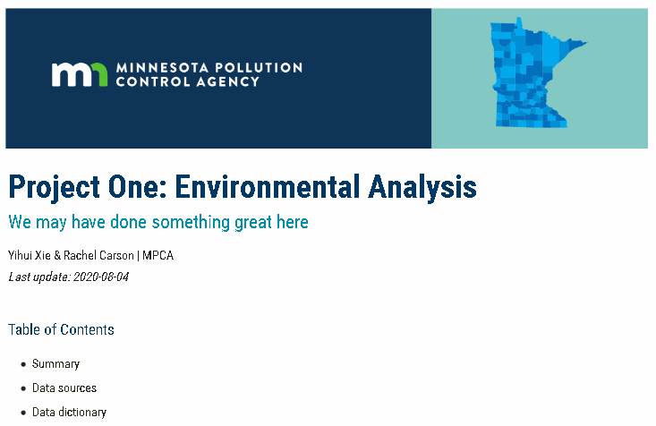

# mpcareports
:bookmark_tabs: Report templates for R Markdown documents  |   https://mpca-data.github.io/mpcareports/web/

The package includes templates for making reports from R in the following formats:

- Web report (HTML)
- Web Tufte report with side column (HTML)
- Word document with MPCA theme (Word)
- PDF Tufte document with side column (PDF)


## What is R Markdown?

If you're new to Markdown documents, here is a nice little intro video and gallery of examples https://rmarkdown.rstudio.com/lesson-1.html. In short, it takes your R script, comments, and charts and turns it into a friendly readable document ready for public viewing. 

For example: 


## Install

Install `mpcareports` from GitHub:

``` r
# 1. Install the 'devtools' package
install.packages("devtools")
library(remotes)

# 2. Install the development pkg from GitHub
remotes::install_github("MPCA-data/mpcareports")
```

-----

## Use

After installing and restarting RStudio, when you create a new RMarkdown file in RStudio select the bottom option for "Template" to see several _MPCA report_ options to choose from. Here's a snippet of the Web report below. You can view the full version at https://mpca-data.github.io/mpcareports/web/.



...  

---

<br>